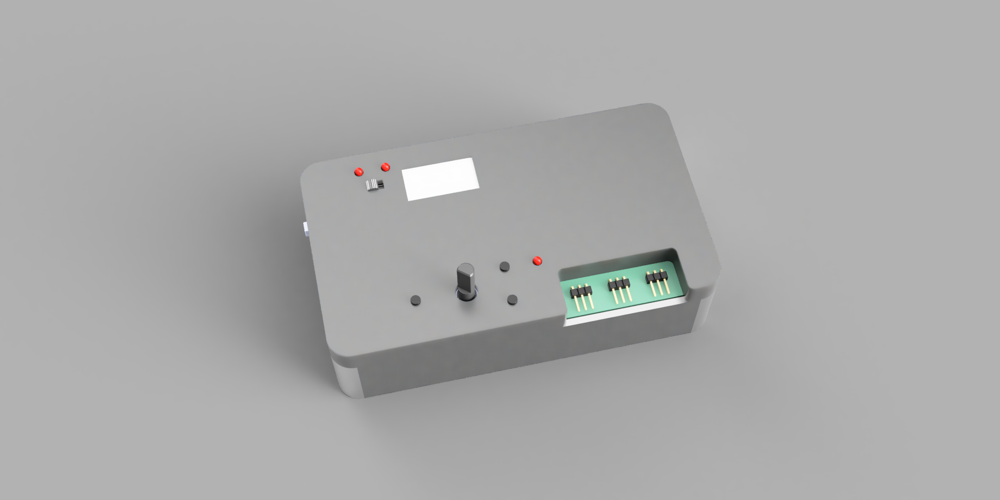

# Servo Tester

> **Work In Progress (WIP):** This project is under active development.  
> Features, wiring, and behavior may change between commits.

RC servo tester for Arduino Pro Mini (ATmega328P, 16 MHz) with OLED UI, settings in EEPROM, and 3-channel current monitoring via INA3221.

User manual: `MANUAL.md`

## Features

- Servo control modes: `POT`, `CENTER`, `SWEEP`
- OLED screens: `STATUS`, `GAUGE`, `CURRENT`, `VBUS`, `PEAK`
- SWEEP cycle counter shown only in SWEEP mode
- Settings menu with EEPROM persistence
- INA3221 current measurement on 3 channels
- INA3221 bus voltage and droop (`dV`) view per channel
- INA3221 per-channel warning/critical current alerts (`WR`/`CR`)
- Optional alert LED output when any channel is in `WR` or `CR`
- Automatic unit display (`mA` / `A`) on current screens
- Servo rail mode detection (`STD` / `HV`) from ADC voltage sensing on `A1`

## Controls

- `SELECT` short press: switch LCD screen (`STATUS -> GAUGE -> CURRENT -> VBUS -> PEAK`)
- `SELECT` long press: enter settings menu
- `UP` / `DOWN` in status mode: change control mode (`POT`, `CENTER`, `SWEEP`)
- `UP` / `DOWN` in menu: navigate items or change value
- `SELECT` in menu: confirm

## Settings Menu

- `Min pulse` (us)
- `Max pulse` (us)
- `Reverse`
- `Sweep cycle` (0.5-10.0 s, default 3.0 s)
- `Save & exit`
- `Cancel`

## Pin Mapping (Default)

- `D2`: `BTN_UP_PIN`
- `D3`: `BTN_DOWN_PIN`
- `D5`: `BTN_SELECT_PIN`
- `D6`: `SERVO_PIN`
- `D7`: `STD_MODE_LED_PIN`
- `D8`: `HV_MODE_LED_PIN`
- `D4`: `ALERT_LED_PIN` (optional alert LED)
- `D9`: OLED `CLK`
- `D10`: OLED `MOSI`
- `D11`: OLED `RESET`
- `D12`: OLED `DC`
- `D13`: OLED `CS`
- `A0`: potentiometer
- `A1`: servo rail voltage sensing (divider)
- `A4`: I2C `SDA` (INA3221)
- `A5`: I2C `SCL` (INA3221)

Full mapping is in `pins.txt`.

## Configuration

Main configuration is in `include/config.h`.

You can adjust:

- pin assignments
- button debounce and long-press timing
- servo pulse limits and step size
- sweep timing and limits
- INA3221 shunt values and calibration factors
- ADC divider and HV threshold

## Build

PlatformIO environment:

- file: `platformio.ini`
- env: `pro16MHzatmega328`

Libraries used:

- Adafruit SSD1306
- Adafruit GFX Library
- Adafruit INA3221 Library
- Servo

## Project Layout

- `src/main.cpp`: entry point (`setup` / `loop`)
- `src/app_controller.*`: app state machine and high-level control flow
- `src/display_ui.*`: OLED rendering
- `src/ina_monitor.*`: INA3221 handling and peak tracking
- `src/button_input.*`: button debounce and short/long press events
- `src/settings_store.*`: EEPROM load/save/validation
- `src/app_types.h`: shared app structs/enums
- `hardware/Kicad/Servo Tester/`: KiCad project files for PCB/schematic
- `hardware/Schematics/`: exported schematic PDFs
- `hardware/Datasheets/`: component datasheets
